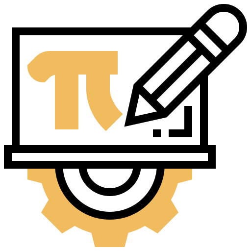
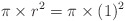
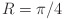
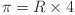
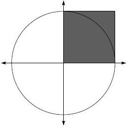
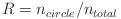
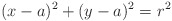
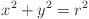
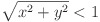

</img>

# Monte Carlo π approximation

Monte Carlo simulations are computational algorithms that rely on sampling of random numbers. Simulation of random numbers is then repeated a large number of times to estimate something. This program allows for a numerical determining the value of π. Let's begin by observing a circle with a radius of 1 whose area is calculated as </img>. Then the area of the quarter circle is π/4 and the area contained within the square in the first quadrant is 1. Finally, the ratio of the quarter circle to the area of the square is </img>, where ratio is denoted with an R. From there we can calulate the numerical value of π as </img>. 
 This way the problem of calculating the numerical value of π is transformed into the problem of determining the ratio R. Simulation starts by generating a coordinate (two values, x and y) in the first quadrant. Two random values, x and y, are both uniformly distributed between 0 and 1. During the simulation, we count the number of times a coordiante falls within the circle quarter and the number of total times coordinate was generated. Then the ratio of the two areas is calculated as </img>. To indentify which coordiante fall within the circle in an ZY Cartesian coordinate system we use the <i>equation of the circle</i> </img>. In this example the circle center is (0,0) and the radius is 1, so the equation can be simplified to </img>. Point (x,y) falls within the circle quarter if inequality </img> is true. By repeating this process a large number of times, we can theoretically compute the value of π precision.   
Simulation allows calculation of the number π in two ways:
<ol>
  <li>By setting the repetition number of a simulation.</li>
  <li>By setting the number of decimal places we want to calculate.</li>
</ol> 

## Screenshot
<ol>
  <li>Old design before coordinate system visualization:
  

</li>
  <li>New design with coordinate system visualization:
  

</li>
</ol>

## References
### Books
<ul>
  <li>
<a href="https://www.amazon.com/Measuring-Computer-Performance-Practitioners-Guide/dp/0521646707">David J. Lilja - <i>Measuring Computer Performance: A Practitioner's Guide</i>
</a></li>
</ul>

## To-Do List
- [x] Refactor code
- [x] Implement coordinate system visualization.
- [ ] ~~Remove limit when calculating number π using number of decimal places.~~